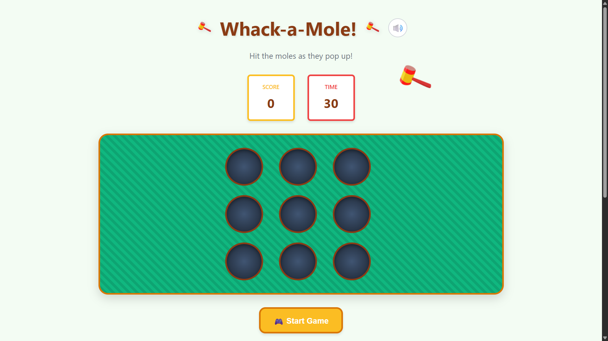
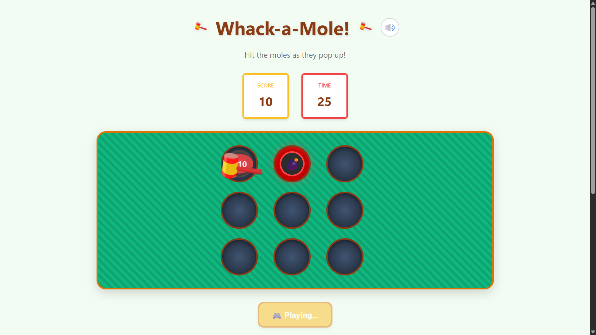
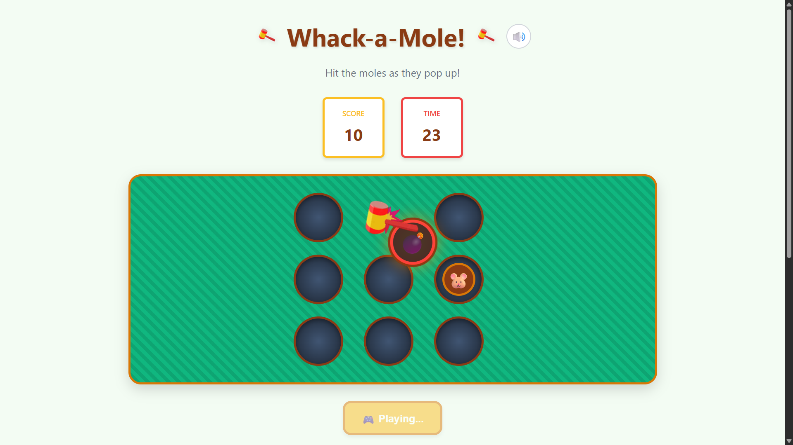
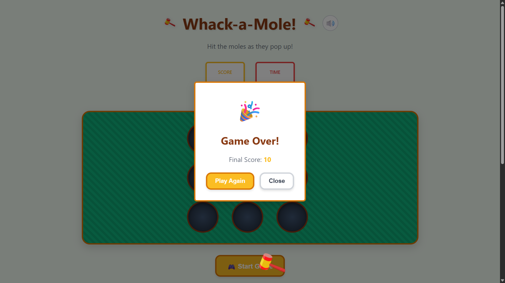

# 🔨 Whack-a-Mole Game

A fun and engaging browser-based Whack-a-Mole game built with pure HTML5, CSS3, and vanilla JavaScript. Challenge yourself to hit as many moles as possible while avoiding bombs in this classic arcade-style game!

Play here 👉🏻 - [https://whackmaster.vercel.app]

## 🎮 Demo & Screenshots


*Game start screen with 3x3 grid ready for action*


*Active gameplay showing mole hits and scoring*


*Advanced gameplay with moles and bombs appearing*


*Game over screen with final score and replay option*

## ✨ Features

### Core Gameplay
- **30-second time limit** - Fast-paced action that keeps you engaged
- **3x3 grid layout** - Classic whack-a-mole setup with 9 holes
- **Dynamic mole spawning** - Moles appear randomly with varying timing
- **Bomb mechanics** - Avoid hitting bombs that appear after 5 seconds
- **Score system** - Earn 10 points per successful mole hit
- **High score persistence** - Your best scores are saved locally

### Controls & Interaction
- **Mouse support** - Click directly on moles and holes
- **Keyboard support** - Use numpad keys 1-9 for grid positions
- **Custom hammer cursor** - Animated hammer with rotation effects
- **Visual feedback** - Hit effects, animations, and smooth transitions

### Audio & Visual Effects
- **Sound effects** - Hit sounds, explosions, and background music
- **Toggle sound** - Mute/unmute functionality with state persistence
- **CSS animations** - Smooth mole pop-ups and hammer strikes
- **Responsive design** - Works on desktop, tablet, and mobile devices

### Technical Features
- **No dependencies** - Pure vanilla JavaScript implementation
- **Local storage** - High scores and settings persistence
- **Cross-browser compatibility** - Works in all modern browsers
- **Performance optimized** - Efficient DOM manipulation and animations

## 🚀 Installation & Setup

### Option 1: Local Development
1. **Clone or download** this repository
2. **Navigate** to the project directory
3. **Start a local server**:
   ```bash
   # Using Python 3
   python3 -m http.server 5000
   
   # Using Python 2
   python -m SimpleHTTPServer 5000
   
   # Using Node.js (if you have http-server installed)
   npx http-server -p 5000
   ```
4. **Open your browser** and go to `http://localhost:5000`

### Option 2: Direct File Opening
Simply open `index.html` in any modern web browser. Note that some browsers may restrict certain features when opening files directly.

### Option 3: Deploy to Web
Upload all files to any web hosting service:
- GitHub Pages
- Netlify
- Vercel
- Any static file hosting service

## 🎯 How to Play

### Basic Gameplay
1. **Click "Start Game"** to begin the 30-second challenge
2. **Hit the moles** as they pop up from holes by clicking or using numpad keys
3. **Avoid bombs** (💣) that appear after 5 seconds - hitting them ends the game
4. **Score points** - Each successful mole hit earns 10 points
5. **Beat your high score** and try to improve with each game

### Controls
- **Mouse**: Click directly on moles when they appear
- **Keyboard**: Use numpad keys 1-9 (mapped to grid positions)
  ```
  7 8 9
  4 5 6  
  1 2 3
  ```
- **Sound Toggle**: Click the 🔊 button to mute/unmute audio

### Tips for High Scores
- Stay focused and react quickly when moles appear
- Use both mouse and keyboard for faster responses
- Avoid clicking on bombs - they end the game immediately
- Practice to improve your reaction time and accuracy

## 🛠 Technologies Used

### Frontend
- **HTML5** - Semantic structure and game layout
- **CSS3** - Styling, animations, and responsive design
- **Vanilla JavaScript (ES6+)** - Complete game logic and interactions

### Browser APIs
- **Web Audio API** - Sound generation and audio management
- **localStorage API** - High score and settings persistence
- **DOM APIs** - Element manipulation and event handling
- **CSS Animation APIs** - Visual effects and transitions

### Development Tools
- **Python** - For audio file generation script
- **Static file server** - For local development and testing

## 📁 Project Structure

```
whack-a-mole/
├── index.html              # Main HTML file
├── styles.css              # Complete CSS styling and animations
├── script.js               # Game logic and JavaScript functionality
├── assets/
│   ├── hammer-icon.png     # Hammer icon for UI
│   ├── hammer-cursor.png   # Custom cursor image
│   ├── hammer-cursor-128.png # High-res cursor for different displays
│   ├── sounds/             # Audio files directory
│   │   ├── hit.wav         # Mole hit sound effect
│   │   ├── explosion.wav   # Bomb explosion sound
│   │   ├── mole_pop.wav    # Mole appearing sound
│   │   ├── background_music.wav # Game background music
│   │   ├── ambient_music.wav    # Menu ambient music
│   │   ├── hammer_hit.wav  # Hammer strike sound
│   │   ├── button_click.wav # UI button sound
│   │   ├── ting.wav        # Success sound
│   │   └── game_over.wav   # Game over sound
│   └── screenshots/        # Game screenshots for README
├── pyproject.toml          # Python dependencies for development
└── README.md              # This file
```

## 🤝 Contributing

Contributions are welcome! Here's how you can help improve the game:

### Ways to Contribute
- **Bug fixes** - Report and fix any issues you find
- **Feature enhancements** - Add new gameplay mechanics or features
- **Performance improvements** - Optimize code and animations
- **Accessibility** - Improve keyboard navigation and screen reader support
- **Mobile optimization** - Enhance touch controls and responsive design

### Development Guidelines
1. **Fork** the repository
2. **Create a feature branch** (`git checkout -b feature/amazing-feature`)
3. **Test thoroughly** on multiple browsers and devices
4. **Commit your changes** (`git commit -m 'Add amazing feature'`)
5. **Push to the branch** (`git push origin feature/amazing-feature`)
6. **Open a Pull Request** with a clear description of changes

### Code Style
- Use consistent indentation (2 spaces)
- Follow existing naming conventions
- Add comments for complex logic
- Test on modern browsers (Chrome, Firefox, Safari, Edge)

## 📜 License

This project is licensed under the **MIT License** - see the [LICENSE](LICENSE) file for details.

### MIT License Summary
- ✅ Commercial use allowed
- ✅ Modification allowed
- ✅ Distribution allowed
- ✅ Private use allowed
- ❗ License and copyright notice required

## 🎨 Credits & Acknowledgments

### Inspiration
- Classic arcade Whack-a-Mole games
- Modern web game design principles
- Retro gaming aesthetics

### Assets
- **Hammer icons**: Custom designed for this project
- **Sound effects**: Generated using Web Audio API and Python scripts
- **Emojis**: Standard Unicode emoji characters
- **Design inspiration**: Classic carnival and arcade games

### Technical References
- MDN Web Docs for JavaScript and Web APIs
- CSS Grid and Flexbox specifications
- Web Audio API documentation
- Modern JavaScript best practices

## 📞 Contact & Support

### Get in Touch
- **Issues**: Report bugs or request features via GitHub Issues
- **Discussions**: Share ideas and feedback in GitHub Discussions
- **Email**: [jatin0e0help.com](mailto:jatin0e0help.com)

### Support
If you enjoy this game:
- ⭐ **Star the repository** to show your support
- 🐛 **Report bugs** to help improve the game
- 💡 **Suggest features** for future updates
- 🔄 **Share with friends** who might enjoy playing

---

**Happy Whacking!** 🔨🐹

*Built with ❤️ using vanilla web technologies*